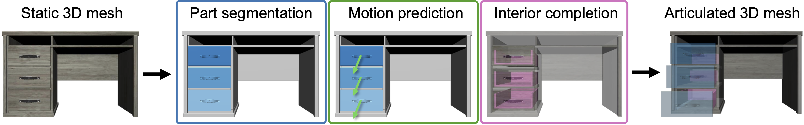

# S2O: Static to Openable Enhancement for Articulated 3D Objects

Denys Iliash1,
[Hanxiao Jiang](https://jianghanxiao.github.io)2,
[Yiming Zhang](https://scholar.google.ca/citations?user=scUaE38AAAAJ&hl=en)1,
[Manolis Savva](https://msavva.github.io)1,
[Angel X. Chang](https://angelxuanchang.github.io/)1,3

1Simon Fraser University, 2Columbia University, 3Canada-CIFAR AI Chair, Amii

### [Project Page](https://3dlg-hcvc.github.io/s2o/)

This repo contains the code for S2O paper. Data can be found on [HuggingFace](https://huggingface.co/datasets/3dlg-hcvc/s2o).

## Installation

      git clone --recursive git@github.com:3dlg-hcvc/s2o.git
      
      conda create -f environment.yml
      conda activate s2o

Additionally, follow instructions in the submodules you would like to use in order to install additionally-required libraries and build some dependencies from source.

## Data

Data can be found on [HuggingFace](https://huggingface.co/datasets/3dlg-hcvc/s2o). 

## Inference
For PC-based methods run:

    # Pre-processing
    python scripts/preprocess/create_subset_points.py --data_path {path/to/pcd/downsample.h5} --dat_json {path/to/split/json}
    
    # For all PG methods convert to minsu3d format
    python scripts/preprocess/prepare_for_minsu3d.py --data_path {path/to/pcd-subset/downsample.h5} --data_json {path/to/split/json}
    
Follow submodule instructions for inference. Then, for post-processing and mapping run:

    # Post-processing
    
    # Map predictions from subset to full point clouds
    python scripts/postprocess/map_predictions_from_subset_points.py --exp_dir {path/to/predictions} --data_path {path/to/pcd/downsample.h5} --subset_path {path/to/pcd-subset/downsample.h5} --output_path {path/to/full/predictions}
    
    # Map full predictions to mesh, use --gt flag with this script to generate gt for evaluation
    python scripts/postprocess/map_pc_to_mesh.py --{path/to/full/predictions} --data_path {path/to/processed_mesh} --data_json {path/to/split/json} --sampled_data {path/to/pcd/downsample.h5} --output_dir {path/to/mapped/meshes/output}

To run heuristic motion prediction:

    python motion_inference.py --pred_path {path/to/mapped/meshes/output} --output_path {path/to/mapped/meshes/output/motion} --export

## Evaluation
PC metrics are obtained from minsu3d eval.py and OC-cost demo.py, follow instructions from the submodules to 

    # GT is obtained from running map_pc_to_mesh with --gt flag
    python mesh_eval.py --predict_dir {path/to/mapped/meshes/output} --gt_path {path/to/preprocessed/gt} --output_dir {dir/for/logged/metrics} --data_json {path/to/split/json} --glb_path {path/to/processed_mesh}

    # For metrics from the supplement
    python mesh_eval_seg.py --predict_dir {path/to/mapped/meshes/output} --gt_path {path/to/preprocessed/gt} --output_dir {dir/for/logged/metrics} --data_json {path/to/split/json} --glb_path {path/to/processed_mesh}

    # For motion evaluation
    python motion_eval.py --predict_dir {path/to/mapped/meshes/output} --output_dir {dir/for/logged/metrics} --data_json {path/to/split/json} --glb_path {path/to/processed_mesh}
    
